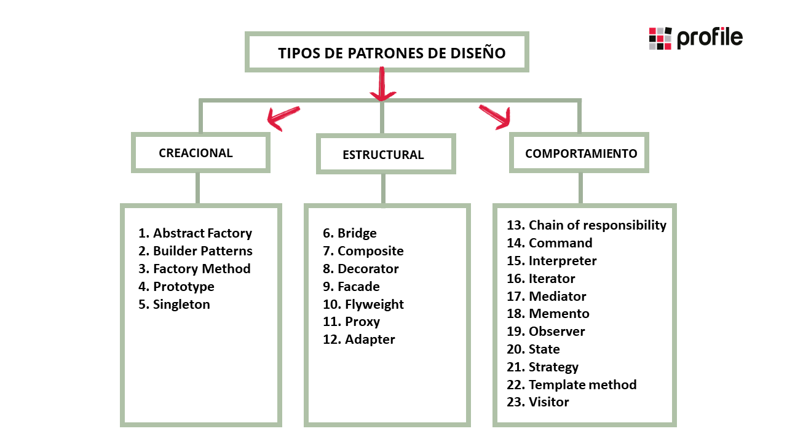
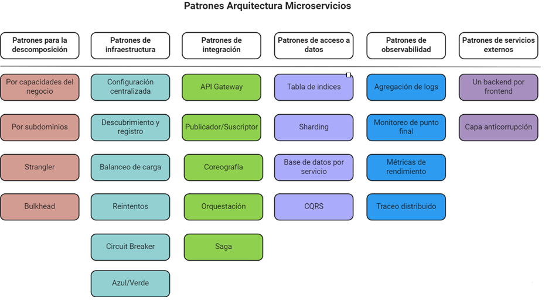
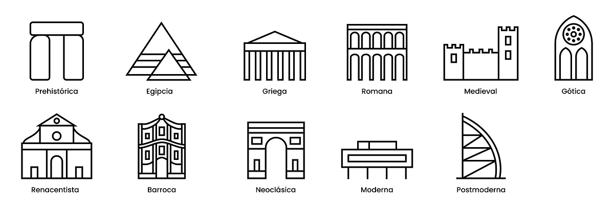

# Arquitectura de software

La arquitectura de software se refiere a la estructura fundamental y el diseño organizativo de un sistema de software. Es un conjunto de decisiones y patrones de diseño que determinan cómo los componentes de software interactúan entre sí y cómo se organizan para lograr los objetivos del sistema. Esta arquitectura proporciona una visión de alto nivel del sistema, describiendo sus componentes, sus relaciones y sus funciones principales.

Una buena arquitectura de software es crucial para garantizar la calidad, la escalabilidad, la mantenibilidad y la eficiencia de un sistema. Define la base sobre la cual se construirá el software y permite a los desarrolladores, diseñadores y otros interesados comprender cómo se estructura el sistema y cómo los diferentes componentes trabajan juntos para cumplir con los requisitos del proyecto.

En resumen, la arquitectura de software es el plano maestro que guía el proceso de desarrollo de software y proporciona una estructura coherente para que el sistema funcione de manera efectiva y cumpla con sus objetivos.

**Ejemplo**:

​				La arquitectura de software es como el plano de una casa. Es la estructura principal que muestra 				cómo todas las partes del software encajan y se comunican entre sí. Ayuda a los programadores a 				construir el software de manera eficiente y asegurarse de que funcione bien. Es como el esqueleto 				del software que lo mantiene organizado y en buen estado.

# Patron de diseño

### ¿Qué es?

Un patrón de diseño es una solución comprobada y reutilizable para un problema común en la creación de software. Actúan como recetas para resolver desafíos específicos en el diseño de software de manera efectiva.

**Ejemplo**:

Un patrón de diseño es una especie de "receta" probada que los programadores utilizan para solucionar problemas comunes al hacer programas de computadora. Ayuda a hacer el trabajo más fácil y eficiente.

### Lo importante a tener en cuenta, y que tienen en comun

Los patrones de diseño son importantes porque:

1. Ahorran tiempo: Te ayudan a usar soluciones ya probadas en lugar de inventar todo desde cero.

2. Hacen que el trabajo sea más consistente: Ayudan a que todo el código tenga una estructura similar y sea más fácil de entender y mantener.

3. Facilitan la comunicación: Proporcionan un lenguaje común para que los equipos de desarrollo se entiendan entre sí.

4. Siguen buenas prácticas: Se basan en lo que ha funcionado en la industria, por lo que son soluciones confiables.

5. Son flexibles: Permiten adaptarse a cambios más fácilmente.

En resumen, los patrones de diseño son soluciones probadas que ahorran tiempo, hacen que el código sea más consistente y facilitan la comunicación entre los equipos de desarrollo. También se basan en buenas prácticas y permiten adaptarse a cambios más fácilmente.

**Ejemplo de tipos de patrones**:

### ¿En qué se diferencian?

Los patrones arquitectónicos son soluciones recurrentes para problemas comunes en el diseño de software a nivel de arquitectura. Cada patrón arquitectónico tiene características y propósitos específicos que lo diferencian de otros patrones. Aquí hay algunas diferencias clave que pueden ayudarte a entender cómo se distinguen unos de otros:

1. **Propósito y problema a resolver**: Cada patrón arquitectónico se utiliza para abordar un conjunto específico de problemas o desafíos arquitectónicos. Por ejemplo, el patrón "MVC" (Model-View-Controller) se utiliza para separar la lógica de presentación de la lógica de negocio, mientras que el patrón "Cliente-Servidor" se utiliza para separar la aplicación en componentes cliente y servidor para permitir la comunicación entre ellos.

2. **Estructura y organización**: Los patrones arquitectónicos definen la estructura y organización de un sistema de software en términos de componentes, relaciones y responsabilidades. Cada patrón tiene una estructura específica que se adapta a su propósito. Por ejemplo, el patrón "Capas" organiza el sistema en capas horizontales, mientras que el patrón "Pipes and Filters" organiza el flujo de datos a través de una serie de filtros.

3. **Participantes y roles**: Los patrones arquitectónicos involucran diferentes roles o participantes que cumplen funciones específicas en el sistema. Estos roles y participantes varían según el patrón. Por ejemplo, el patrón "Microservicios" implica roles como el servidor, el cliente y la gestión de la infraestructura, mientras que el patrón "Monolito" no involucra la división en microservicios y tiene un único componente central.

4. **Escenarios de uso**: Cada patrón arquitectónico se aplica a escenarios de uso específicos. Algunos patrones son más adecuados para sistemas web, mientras que otros son ideales para sistemas embebidos o sistemas en tiempo real. Por ejemplo, el patrón "Publicador-Subscriptor" se utiliza en sistemas de notificación y eventos, mientras que el patrón "Arquitectura Hexagonal" se enfoca en la separación de la lógica de negocio de la lógica de aplicación.

5. **Ventajas y desventajas**: Cada patrón arquitectónico tiene sus propias ventajas y desventajas. Algunos pueden mejorar la escalabilidad, la mantenibilidad o la flexibilidad del sistema, mientras que otros pueden introducir complejidad adicional. Las ventajas y desventajas varían según el contexto y los requisitos del proyecto.

6. **Implementación tecnológica**: Algunos patrones arquitectónicos pueden estar más estrechamente relacionados con ciertas tecnologías o marcos de desarrollo, mientras que otros son independientes de las tecnologías utilizadas.

En resumen, los patrones arquitectónicos se diferencian por su propósito, estructura, roles, escenarios de uso, ventajas y desventajas, y su relación con las tecnologías. La elección del patrón arquitectónico adecuado depende de los requisitos y el contexto específico del proyecto de software que estás desarrollando.

# Estilos arquitectonicos

### ¿Que son?

Los estilos arquitectónicos son como diferentes estilos de construcción para edificios. Cada estilo tiene su propio enfoque en cómo organizar y diseñar el edificio.

Imagina que estás construyendo una casa y puedes elegir entre diferentes estilos arquitectónicos. Algunos estilos te permiten tener un diseño muy abierto y espacioso, con habitaciones grandes y mucha luz natural. Otros estilos pueden ser más compactos y enfocados en la eficiencia. Algunos estilos pueden enfatizar la privacidad de las habitaciones, mientras que otros fomentan la interconexión entre las áreas de la casa.

Cada estilo arquitectónico tiene sus propias características, como ventanas, puertas, techos altos o bajos, y diferentes formas de organizar las habitaciones. La elección del estilo depende de cómo quieras que se vea y funcione tu casa.

De manera similar, en el mundo del software, los estilos arquitectónicos definen cómo se organiza y se comunican las partes de un sistema de software. Puedes elegir un estilo que se adapte mejor a los objetivos y requisitos de tu proyecto, de la misma manera en que elige un estilo arquitectónico para una casa según tus preferencias y necesidades.

### Es importante tener en cuenta

Lo más importante en los estilos de arquitectura es que se adapten a lo que tu proyecto de software necesita. Al igual que cuando construyes una casa, debes elegir un estilo que se ajuste a tus gustos y necesidades, pero en el software, esas necesidades pueden ser más técnicas.

Entonces, ¿qué debes tener en cuenta al elegir un estilo?

1. **Cumplir los Requisitos**: Asegurar de que el estilo de arquitectura te permita hacer todo lo que necesitas que haga tu software, como funcionar rápido, ser seguro y fácil de usar.
2. **Facilidad de Cambios**: Debe ser facil hacer cambios en el software en el futuro sin que todo se vuelva un lío. Piensa en ello como poder cambiar el color de las paredes de tu casa sin tener que derribar toda la estructura.
3. **Funcionamiento Eficiente**: Querrás que el software funcione sin problemas y sin problemas de velocidad.
4. **Crecimiento Posible**: El estilo debe permitir que el software crezca si es necesario, sin tener que empezar desde cero.
5. **Seguridad**: Asegurar de que el software esté protegido contra problemas de seguridad y hackers.
6. **Sencillo de Crear**: El estilo debe ser algo que tu equipo de desarrollo pueda manejar y que no sea demasiado complicado.
7. **Costos Controlados**: Debes considerar cuánto dinero costará usar un estilo en particular. Algunos estilos pueden ser más caros que otros.
8. **Compatibilidad**: Asegurar de que el software pueda trabajar bien con otros programas o sistemas si es necesario.
9. **Regulaciones Cumplidas**: Si tienes reglas o leyes que debes seguir, como las normas de construcción en una casa, asegúrate de que el estilo de arquitectura las cumpla.
10. **Buenas Experiencias para los Usuarios**: El estilo también debe permitir que las personas que usen tu software tengan una buena experiencia.

En resumen, la elección del estilo de arquitectura en el software es como elegir un diseño para tu casa. Debe ser funcional, eficiente y adaptable a tus necesidades y presupuesto.

**SOLID:** El principio SOLID es un conjunto de reglas simples que nos ayudan a escribir programas de computadora más fáciles de entender y mantener. Cada letra de SOLID representa un consejo diferente para hacer que el código sea ordenado y flexible. Al seguir estos consejos, se vuelve más sencillo agregar nuevas funciones o hacer cambios en el software sin causar problemas en otras partes del programa. En resumen, SOLID es como un conjunto de buenas prácticas que nos ayuda a escribir código más claro y organizado.