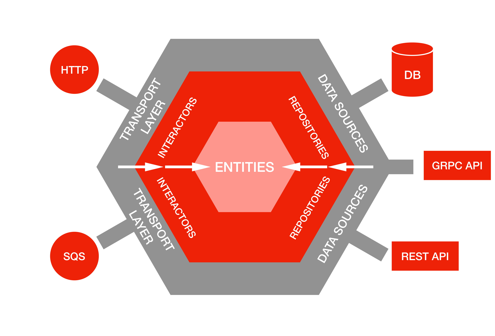
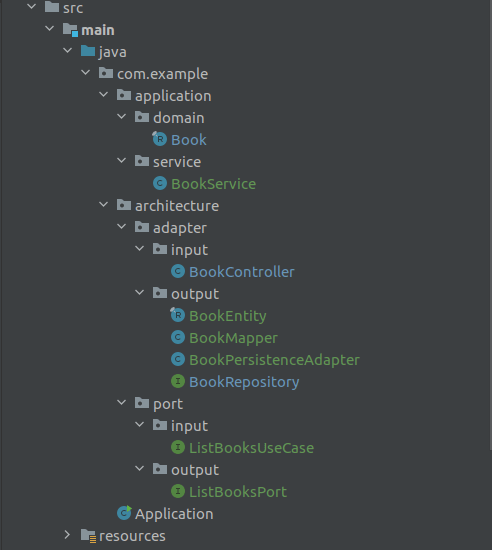

# Arquitectura hexagonal

La arquitectura hexagonal, también conocida como "puertos y adaptadores", es una forma de organizar un sistema de software para que sea fácil de entender y modificar. En lugar de tener una estructura de software que gira en torno a las bases de datos o las interfaces de usuario, la arquitectura hexagonal se centra en las reglas de negocio del software.

Imagina un edificio con muchas puertas, donde cada puerta es una forma de interactuar con el software, como la interfaz de usuario, una API web o una base de datos. En el centro del edificio están las reglas de negocio del software. Las puertas (interfaces) permiten que el mundo exterior se conecte con esas reglas de negocio, pero no necesitas saber lo que hay afuera de esas puertas para entender cómo funcionan las reglas de negocio.

Esto significa que puedes cambiar lo que está afuera de las puertas sin afectar las reglas de negocio en el centro. Puedes reemplazar una base de datos o una interfaz de usuario sin cambiar la lógica interna del software.

En resumen, la arquitectura hexagonal se trata de mantener las reglas de negocio en el centro y separar las formas en que el mundo exterior se conecta con esas reglas, lo que hace que el software sea más flexible y fácil de mantener.

### Lo importante a tener en cuenta

En una arquitectura hexagonal, lo más importante es tener en cuenta cómo organizas tu software para que sea fácil de entender y cambiar en el futuro. Aquí están algunos puntos clave en un lenguaje menos técnico:

1. **Mantener las Reglas Importantes en el Centro**: Imagina que tu software tiene reglas importantes, como las reglas de un juego. Esas reglas deben estar en el centro y ser lo más claras posible. No quieres que se mezclen con cosas menos importantes.

2. **Puertas de Entrada y Salida**: Piensa en el software como una casa con puertas. Las puertas son las formas en que las personas (o sistemas) interactúan con el software. Debes tener puertas bien definidas para que sea fácil entrar y salir, como puertas para el usuario y puertas para la base de datos.

3. **Independencia de las Puertas**: Las puertas deben ser independientes. Si cambias una puerta (como usar una puerta diferente para la base de datos), no debería cambiar cómo funcionan las reglas importantes en el centro. Esto te permite hacer cambios sin estropear todo el sistema.

4. **Pruebas Sencillas**: Puedes probar las reglas importantes por sí solas sin necesidad de preocuparte por todas las puertas. Esto es como poder probar las reglas de un juego sin necesidad de que todo el mundo juegue.

5. **Fácil Mantenimiento**: Con todo organizado de esta manera, es más fácil arreglar cosas y hacer mejoras sin causar problemas en otros lugares. Es como remodelar una habitación de tu casa sin afectar el resto de la casa.

En resumen, la arquitectura hexagonal se trata de mantener las reglas importantes en el centro, con puertas de entrada y salida bien definidas y separadas, lo que hace que el software sea más fácil de entender y cambiar a medida que evolucionan las necesidades.

**Ejemplo de organizacion**:

------

#### Echo por:

Ludwing Santiago Villamizar Murillo