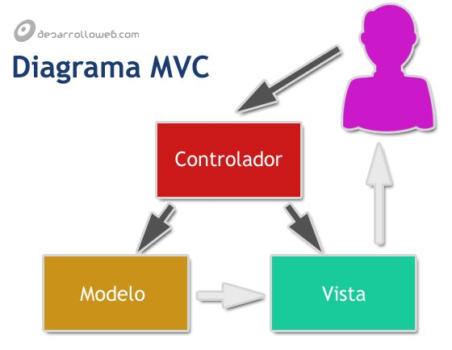
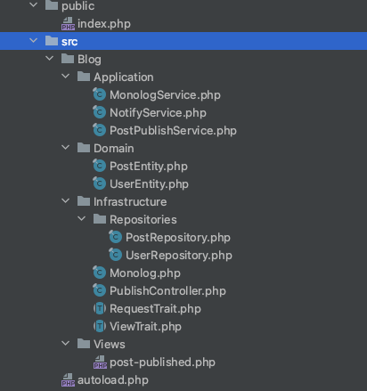

# Arquitectura vista controlador

La arquitectura Vista-Controlador es como la forma en que una tienda está organizada.

- **Vista**: La "vista" es como la parte de la tienda que ves, con estantes y productos en exhibición. En el software, esto serían las cosas que ves en la pantalla, como botones y ventanas.
- **Controlador**: El "controlador" es como el empleado de la tienda que te ayuda a encontrar lo que necesitas. En el software, es la parte que toma tus acciones (como hacer clic en un botón) y decide qué debe suceder.
- **Modelo**: Piensa en el "modelo" como el inventario de la tienda. Es donde se almacenan todos los productos. En el software, es donde se guardan los datos y la información.

Entonces, la arquitectura Vista-Controlador mantiene todo ordenado: lo que ves en la pantalla, lo que haces y dónde se almacenan los datos. Es como una tienda bien organizada donde puedes ver los productos, pedir ayuda y saber que todo está en su lugar.

### Lo importante a tener en cuenta

En la arquitectura Vista-Controlador, lo más importante es tener una clara división de responsabilidades y una buena comunicación entre las partes. Aquí tienes algunas claves en un lenguaje más sencillo:

1. **Roles Claros**: Imagina una obra de teatro. Los actores (vista) muestran la historia al público, el director (controlador) les dice qué hacer, y el guión (modelo) contiene la historia. En tu software, es esencial que cada parte sepa su trabajo.

2. **Buenas Comunicaciones**: En una obra de teatro, los actores necesitan escuchar al director y seguir el guión para que la historia sea coherente. En tu software, la vista debe comunicar lo que el usuario quiere, el controlador decide qué hacer y el modelo almacena los datos.

3. **Cambios Sin Confusión**: Si el guión cambia, los actores aún saben qué hacer. De manera similar, en la arquitectura Vista-Controlador, si necesitas hacer cambios en cómo se muestra la información (vista), no debería afectar la lógica de cómo funciona el software (controlador) o la base de datos (modelo).

4. **Fácil Mantenimiento**: Imagina que puedes cambiar un actor en una obra sin que todo el espectáculo se derrumbe. En tu software, la arquitectura Vista-Controlador facilita hacer cambios en una parte sin que todo el sistema se vea afectado.

5. **Mejor Comprender**: Al mantener roles claros y una comunicación ordenada, tanto los programadores como los usuarios pueden entender y usar el software más fácilmente.

En resumen, la arquitectura Vista-Controlador es como una obra de teatro bien ensayada, donde cada parte tiene un papel definido y todos trabajan juntos para presentar una historia coherente. Esto hace que el software sea más fácil de entender, mantener y mejorar con el tiempo.

**Ejemplo de organizacion**:

#### Echo por:

Ludwing Santiago Villamizar Murillo