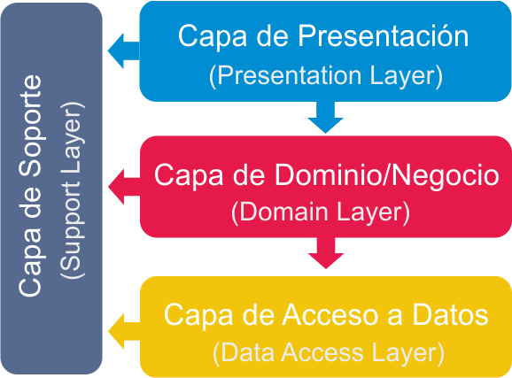
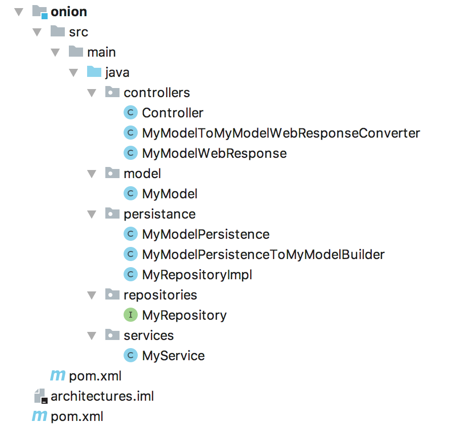

# Arquitectura entre capas

La arquitectura entre capas es una forma de organizar un sistema de software para que sus diferentes partes estén bien organizadas y separadas. Imagina que estás construyendo una casa y decides dividirla en varios niveles o pisos. Cada piso tiene un propósito específico. Por ejemplo, en el primer piso, tienes la sala de estar; en el segundo piso, los dormitorios; y en el tercer piso, un área de entretenimiento.

En una arquitectura entre capas, el software se organiza de manera similar. Cada "piso" o capa tiene una función específica. Por ejemplo, una capa puede encargarse de mostrar la información en la pantalla (interfaz de usuario), otra capa puede manejar las reglas de negocio (cómo funcionan las cosas), y una capa más puede encargarse de guardar la información en una base de datos.

Lo importante es que cada capa se encarga de su trabajo sin preocuparse demasiado por lo que hacen las otras capas. Esto hace que el software sea más fácil de entender, mantener y cambiar, ya que si necesitas hacer una modificación, puedes hacerlo en una capa sin afectar necesariamente las demás. Es como si pudieras redecorar un piso de tu casa sin tener que tocar los otros pisos.

En resumen, la arquitectura entre capas es como organizar una casa en diferentes niveles con funciones específicas. En el software, se organiza en capas con roles claros para hacer que sea más fácil de gestionar y adaptar a medida que evolucionan las necesidades.

### Lo importante a tener en cuenta

En una arquitectura entre capas, lo más importante es organizar tu software de manera que sea fácil de manejar y mejorar con el tiempo. Imagina que estás cocinando una hamburguesa. Cada capa en tu software tiene un trabajo específico, como ingredientes en tu hamburguesa.

1. **Capas Claramente Definidas**: Es como tener una capa de pan, una de carne y una de queso en tu hamburguesa. Cada capa tiene su función específica, y eso hace que la hamburguesa (tu software) sea más fácil de construir y entender.

2. **Comunicación Entre Capas**: Las capas deben comunicarse como las capas de una hamburguesa que se combinan para crear un sabor delicioso. En tu software, esto significa que las capas deben trabajar juntas de manera armoniosa para lograr el resultado deseado.

3. **Cambios sin Desorden**: Si decides cambiar un ingrediente en tu hamburguesa, como el queso, no afecta el pan o la carne. De manera similar, en la arquitectura entre capas, puedes hacer cambios en una capa sin perturbar las demás.

4. **Fácil Mantenimiento**: Imagina que puedes reemplazar la carne de tu hamburguesa sin desarmar todo el sándwich. En el software, esto se traduce en que puedes mantener o mejorar una capa sin afectar el resto del sistema.

5. **Escalabilidad**: Piensa en cómo puedes hacer más hamburguesas si tienes invitados. En tu software, la arquitectura entre capas te permite hacer crecer tu aplicación agregando nuevas capas o funcionalidades sin complicaciones.

En resumen, la arquitectura entre capas es como apilar ingredientes en una hamburguesa: cada capa tiene su trabajo y se combinan para hacer una hamburguesa deliciosa. De la misma manera, cada capa de software tiene una tarea específica y se combinan para hacer que tu aplicación funcione sin problemas y sea fácil de mejorar.

**Ejemplo de organizacion**:

------

#### Echo por:

Ludwing Santiago Villamizar Murillo